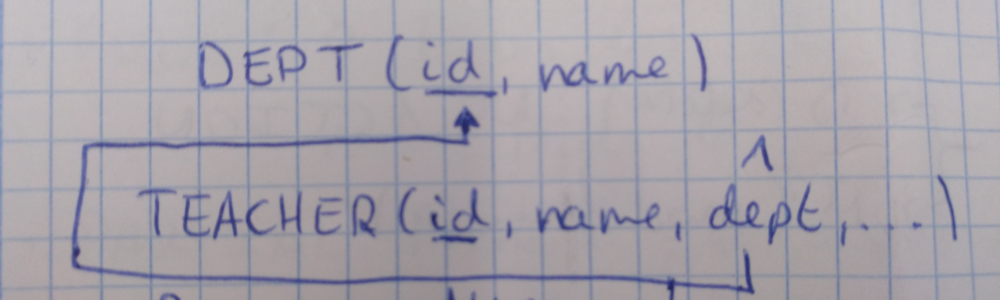

Hay 6 sublenguajes de SQL y un único lenguaje SQL.
- **DQL** = Data Query Languaje -> SELECT. Opera sobre los datos.
- **DML** = Data Manipulation Languaje -> INSERT, UPDATE, DELETE. Opera sobre los datos.
- **DDL** = Data Definition Languaje -> CREATE, ALTER, DROP. Opera sobre los objetos de la base de datos.
- **TCL** = Tranaction Control Languaje -> COMMIT, ROLLBACK. 
- **DCL** = Data Control Languaje -> GRANT, REVOKE.
- **SCL** = Session Control Languaje -> ALTER SESSION.

# DDL #
- **CREATE**: 
  - Podemos crear tablas, una base de datos, usuarios (parece que stá más relacionado con DCL que tiene GRANT y REVOKE).
  - Formas de crear una base de datos:
    - CREATE DATABASE myBD;
    - CREATE SCHEMA myotherBD;
  - Fórmula:
    - CREATE (SCHEMA|DATABASE)[IF NOT EXISTS] <database_name>
             [CHARACTER SET <Charset_name>];
  - Anotación sobre la fórmula: **COLLATE** es para poner varios charset.
  - CREATE TABLE Alumno(
        id INTEGER (integer es un dominio) PRIMARY KEY,
        nombre NCHAR(50),
        apellidos NCHAR(200),
        fecNac DATE);

- **RESTRICCIONES:**
  - *Restricción Clave Foránea*:
     
    - [CONSTRAINT <nombre-restricción>]
        FOREING KEY (<atributos>)
        REFERENCES <nombre-tabla-referenciada>
                    [<atributos-refereniados>]
      [MATCH *FULL*|PARTIAL](integridad referencial)
      [ON DELETE CASCADE|*NO ACTION*|SET NULL|SET DEFAULT]
      [ON UPDATE CASCADE|*NO ACTION*|SET NULL|SET DEFAULT]