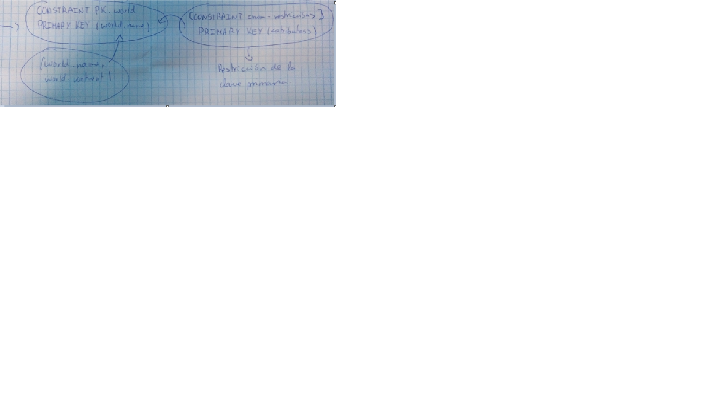

Hay 6 sublenguajes de SQL y un único lenguaje SQL.
- **DQL** = Data Query Languaje -> SELECT. Opera sobre los datos.
- **DML** = Data Manipulation Languaje -> INSERT, UPDATE, DELETE. Opera sobre los datos.
- **DDL** = Data Definition Languaje -> CREATE, ALTER, DROP. Opera sobre los objetos de la base de datos.
- **TCL** = Tranaction Control Languaje -> COMMIT, ROLLBACK. 
- **DCL** = Data Control Languaje -> GRANT, REVOKE.
- **SCL** = Session Control Languaje -> ALTER SESSION.

# DDL #
- **CREATE**: 
  - Podemos crear tablas, una base de datos, usuarios (parece que stá más relacionado con DCL que tiene GRANT y REVOKE).
  - Formas de crear una base de datos:
    - CREATE DATABASE myBD;
    - CREATE SCHEMA myotherBD;
  - Fórmula:
    - CREATE (SCHEMA|DATABASE)[IF NOT EXISTS] <database_name>
             [CHARACTER SET <Charset_name>];
  - Anotación sobre la fórmula: **COLLATE** es para poner varios charset.
  - CREATE TABLE Alumno(
        id INTEGER (integer es un dominio) PRIMARY KEY,
        nombre NCHAR(50),
        apellidos NCHAR(200),
        fecNac DATE);    
         
## **RESTRICCIONES:**
  - *Restricción Clave Foránea*:
     
    - [CONSTRAINT <nombre-restricción>]         
        FOREING KEY (<atributos>)          
        REFERENCES <nombre-tabla-referenciada>          
                    [<atributos-refereniados>]          
      [MATCH *FULL*|PARTIAL](integridad referencial)    
              
      [ON DELETE CASCADE|*NO ACTION*|SET NULL|SET DEFAULT]    
            
      [ON UPDATE CASCADE|*NO ACTION*|SET NULL|SET DEFAULT]     

      - Ejemplo: 
        -     
        - ALTERNATIVA (1 atributo): name NCHAR (80) PRIMARY KEY;      
        
  - **Borrar y Actualizar:**
    - *Borrar:* [ON DELETE *NO ACTION*|CASCADE|SET NULL|SET DEFAULT]
      - NO ACTION --> Si eliminamos algo de la tabla padre, no se modifica en la tabla hija.  
      - CASCADE --> Si eliminamos algo en la tabla padre tambén lo hará en la tabla hija.  
      - SET NULL --> Se modificaría en la tabla hija y mostraría "NULL" (tendría un gran impacto en el rendimiento de la Base de Datos).  
      - SET DEFAULT --> Si se elimina la referencia de la tabla padre, se crea un campo vacío por defecto en la hija.  
    - *Actualizar:* [ON UPDATE NO ACTION|SET NULL|SET DEFAULT|CASCADE]  
      -  NO ACTION --> Si se modifica el padre, el hijo queda igual. Podría desencadenar problemas en la Base de Datos.  
      -  SET NULL --> No desencadenaría problemas en la Base de datos; simplemente pondría como nulo ("NULL") el campo modificado en la tabla padre.  
      -  SET DEFAULT --> Se utiliza mucho en el almacenamiento de datos.  
      -  CASCADE --> Mantendría la Base de Datos actualizada. Si cambias algo en la tabla padre también se cambia en la hija.  
      - > Lo más recomendable, si se cambia algo en la tabla padre, sería hacer ON UPDATE CASCADE.     
          
  - [MATCH *FULL*|PARTIAL] (tiene más sentido utilizarlo en claves foráneas compuestas).
    - FULL --> O todos los campos so nulos o no sirve. Con que haya uno nulo, todos los son.   
    - PARTIAL --> Permite que algún valor sea nulo siempre que las demás puedan referenciar a algún campo válido de la tabla padre.  
  
  - 
