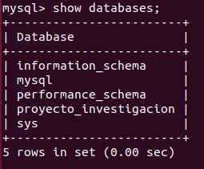
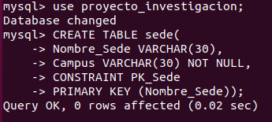
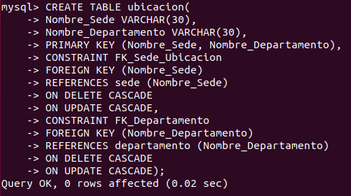
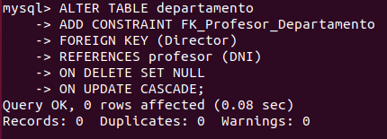
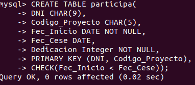
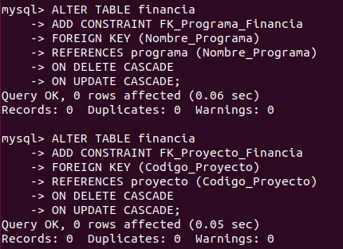

    
     
     
    
    
    
> **Otra forma de crear la tabla de ubucacion sería:**    
> CREATE TABLE ubicacion(  
>   Nombre_Sede VARCHAR(30),  
>   Nombre_Departamento VARCHAR(30),  
>   PRIMARY KEY (Nombre_Sede, Nombre_Departamento),  
>   FOREIGN KEY (Nombre_Sede) REFERENCES sede  
>       ON DELETE CASCADE  
>       ON UPDATE CASCADE,  
>   FOREIGN KEY (Nombre_Depratamento) REFERENCES departamento   
>       ON DELETE CASCADE  
>       ON UPDATE CASCADE  
> );        
   
   
      
    
> En la tabla profesor, decidí poner la experiencia como un entero porque es un número no un boolean (si o no).   
> N_Grupo es el nnombre del grupo.   
> N_Depratamento es el nombre del departamento.   
   

   
>Ahora podemos hacer el alter de la tabla departamento para añadirle la clave foránea. No lo pude hacer antes porque aúyn no habí creado la tabla profesor.         
      
   
> Otra forma de indicar que el atributo Nombre_Proyecto es único sería añadiendo la siguiente línea después de la declaración de todos los atributos:  
> **UNIQUE (Nombre_Proyecto)**    
    
    
    
> En la tabla propgrama podemos ver otra forma de declarar la clave primaria en la misma línea en que definimos el atributo.   
   
      
         
   
       
> --CREATE ASSERTION El_Orzamiento_Incluye_Todo_Lo_Financiado    
>   --CHECK   
>   --proyecto.Orzamento >= SUM(financia.Cantidad_Financiada)   --pseudocódigo   
> --);      
    
       
   
> Em esta imagen vemos que están todas las tablas creadas.   
   
- Ejemplos de situaciones propuesta por el profesor:
  - Si al clave foránea no es correcta, tenemos que hacer un DROP para cargarnos la clave existente y hacer otra nueva. **Caso:** La FK de profesor está mal. Hacer una nueva con borrado y modificación a nulo.  
    > ALTER TABLE profesor    
        DROP CONSTRAINT FK_grupo_profesor; --con esto nos la cargamos.          
      ALTER TABLE profesor     
        ADD CONSTRAINT FK_grupo_profesor     
            FOREIGN KEY (N_Grupo, N_Departamento) REFERENCES grupo    
            ON DELETE SET NULL    
            ON UPDATE SET NULL;     
    
  - **Caso:** Han pasado 3 meses y quieren que la fecha de inicio sea única:     
    > ALTER TABLE proyecto   
        ADD CONSTRAINT Fecha_Inicio_Unica --nombre del constraint   
            UNIQUE (Fec_Inicio);      

